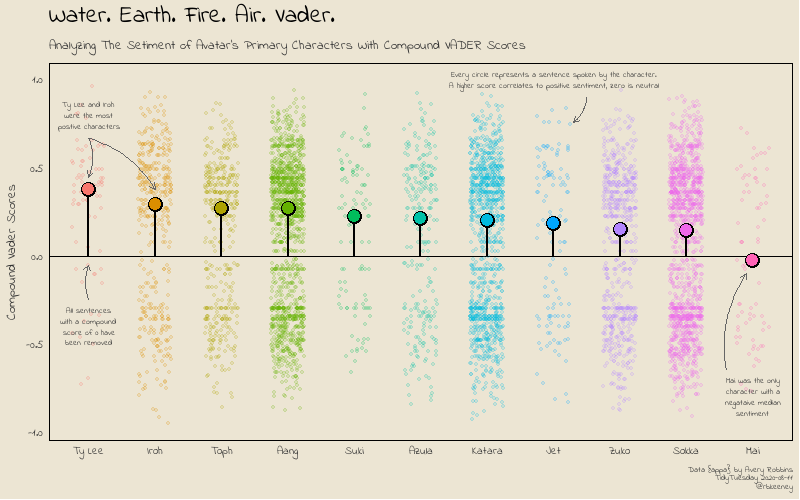
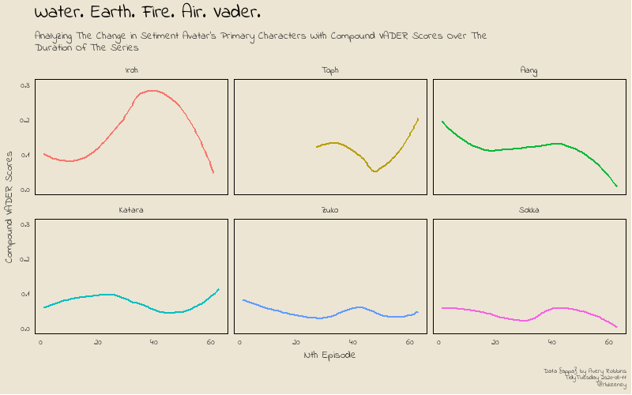

TidyTuesday - Avitar and Vader Sentiment Scores
===============================================

The August 12, 2020 [TidyTuesday](https://github.com/rfordatascience/tidytuesday/tree/master/data/2020/2020-08-11) dataset has a lot of text. It's a perfect opportunity to try out the {vader} package (now available on CRAN!) which can be used for native language processing... or text analytics for beginners like me.

My goal was to analyze character sentiment by breaking down each character's lines and running them through vader. Here are a few questions that I hoped to answer along the way:

1.  Who are the most positive characters?
2.  Who are the most negative characters?
3.  Does character sentiment change over the duration of the series?

I also wanted to explore a few new concepts such as the unique piping operators in {magrittr}, {tvthemes}, fonts, customizing themes, and improving my annotations. And while I wanted to make a word cloud in the shape of appa - that's going to have to wait until next time.

Initial Libraries
-----------------

The first set of libraries to load are as follows. I do load a few font and theme libraries later. But, if you want to use vader this will get you started.

<pre class='chroma'><code class='language-r' data-lang='r'><a href='https://rdrr.io/r/base/library.html'>library</a>(<a href='https://github.com/thebioengineer/tidytuesdayR'>tidytuesdayR</a>) # to get data quickly
<a href='https://rdrr.io/r/base/library.html'>library</a>(<a href='http://tidyverse.tidyverse.org'>tidyverse</a>) # no matter how dark, there is always hope
<a href='https://rdrr.io/r/base/library.html'>library</a>(magrittr) # for some more unique piping options
<a href='https://rdrr.io/r/base/library.html'>library</a>(<a href='http://github.com/trinker/sentimentr'>sentimentr</a>) # for getting sentences
<a href='https://rdrr.io/r/base/library.html'>library</a>(vader) # for vader sentiment scores</code></pre>

As always, TidyTuesday makes it easy to get the data.

<pre class='chroma'><code class='language-r' data-lang='r'>tuesdata &lt;- tidytuesdayR::<a href='https://rdrr.io/pkg/tidytuesdayR/man/tt_load.html'>tt_load</a>('2020-08-11')
avatar &lt;- tuesdata$avatar</code></pre>

Data Inspection
---------------

Here I take a quick look at the data available this week:

| variable         | class     | description                                   |
|:-----------------|:----------|:----------------------------------------------|
| id               | integer   | Unique Row identifier                         |
| book             | character | Book name                                     |
| book\_num        | integer   | Book number                                   |
| chapter          | character | Chapter name                                  |
| chapter\_num     | integer   | Chapter Name                                  |
| character        | character | Character speaking                            |
| full\_text       | character | Full text (scene description, character text) |
| character\_words | character | Text coming from characters                   |
| writer           | character | Writer of book                                |
| director         | character | Director of episode                           |
| imdb\_rating     | double    | IMDB rating for episode                       |

Who speaks the most often?
--------------------------

First, I ran a quick line of code to see who talked the most often and if I need to clean it up a bit. Looks like I'm going to have to remove the "Scene Description". Additionally, I plan on picking a subset of the characters to plot later and I want to see who speaks enough to be included.

<pre class='chroma'><code class='language-r' data-lang='r'>avatar %&gt;% group_by(character) %&gt;% summarize(n=n())%&gt;% arrange(-n) %&gt;% <a href='https://rdrr.io/r/utils/head.html'>head</a>(20) %&gt;% knitr::<a href='https://rdrr.io/pkg/knitr/man/kable.html'>kable</a>()
#&gt; `summarise()` ungrouping output (override with `.groups` argument)
</code></pre>

| character         |     n|
|:------------------|-----:|
| Scene Description |  3393|
| Aang              |  1796|
| Sokka             |  1639|
| Katara            |  1437|
| Zuko              |   776|
| Toph              |   507|
| Iroh              |   337|
| Azula             |   211|
| Jet               |   134|
| Suki              |   114|
| Zhao              |   107|
| Mai               |    82|
| Hakoda            |    77|
| Roku              |    67|
| Ty Lee            |    64|
| Ozai              |    59|
| Bumi              |    55|
| Yue               |    53|
| Hama              |    49|
| Warden            |    49|

Data prep
---------

Thanks to Avery Robbins for dataset {appa}, and there isn't much cleaning do be done, I only removed the "Scene Description". Since I'm also trying to get used to using the magrittr %&lt;&gt;% assignment-piping operator, this was a is was a good opportunity to start.

<pre class='chroma'><code class='language-r' data-lang='r'>avatar_clean &lt;- avatar 
avatar_clean %&lt;&gt;% <a href='https://rdrr.io/r/stats/filter.html'>filter</a>(character != "Scene Description") %&gt;% select(id:character,character_words)
     
<a href='https://rdrr.io/r/base/dim.html'>dim</a>(avatar)
#&gt; [1] 13385    11
<a href='https://rdrr.io/r/base/dim.html'>dim</a>(avatar_clean)
#&gt; [1] 9992    7</code></pre>

VADER compound scores
---------------------

Luke, I am your Father. You can read more about it vader here: [PDF](https://cran.r-project.org/web/packages/vader/vader.pdf). While it is designed for social media, it also aligns pretty well with my priors about the characters.

### Step 1: Sentences. Yip yip!

I'm going to include my code I used to check my process along the way. Here, I check to make sure get\_sentences() is working.

<pre class='chroma'><code class='language-r' data-lang='r'># split out each sentences
avatar_clean %&gt;% <a href='https://rdrr.io/r/utils/head.html'>head</a>(5) %&gt;% <a href='https://rdrr.io/pkg/sentimentr/man/get_sentences.html'>get_sentences</a>() %&gt;% knitr::<a href='https://rdrr.io/pkg/knitr/man/kable.html'>kable</a>()
</code></pre>

<table><colgroup><col style="width: 1%" /><col style="width: 2%" /><col style="width: 3%" /><col style="width: 8%" /><col style="width: 4%" /><col style="width: 3%" /><col style="width: 66%" /><col style="width: 4%" /><col style="width: 4%" /></colgroup><thead><tr class="header"><th style="text-align: right;">id</th><th style="text-align: left;">book</th><th style="text-align: right;">book_num</th><th style="text-align: left;">chapter</th><th style="text-align: right;">chapter_num</th><th style="text-align: left;">character</th><th style="text-align: left;">character_words</th><th style="text-align: right;">element_id</th><th style="text-align: right;">sentence_id</th></tr></thead><tbody><tr class="odd"><td style="text-align: right;">1</td><td style="text-align: left;">Water</td><td style="text-align: right;">1</td><td style="text-align: left;">The Boy in the Iceberg</td><td style="text-align: right;">1</td><td style="text-align: left;">Katara</td><td style="text-align: left;">Water.</td><td style="text-align: right;">1</td><td style="text-align: right;">1</td></tr><tr class="even"><td style="text-align: right;">1</td><td style="text-align: left;">Water</td><td style="text-align: right;">1</td><td style="text-align: left;">The Boy in the Iceberg</td><td style="text-align: right;">1</td><td style="text-align: left;">Katara</td><td style="text-align: left;">Earth.</td><td style="text-align: right;">1</td><td style="text-align: right;">2</td></tr><tr class="odd"><td style="text-align: right;">1</td><td style="text-align: left;">Water</td><td style="text-align: right;">1</td><td style="text-align: left;">The Boy in the Iceberg</td><td style="text-align: right;">1</td><td style="text-align: left;">Katara</td><td style="text-align: left;">Fire.</td><td style="text-align: right;">1</td><td style="text-align: right;">3</td></tr><tr class="even"><td style="text-align: right;">1</td><td style="text-align: left;">Water</td><td style="text-align: right;">1</td><td style="text-align: left;">The Boy in the Iceberg</td><td style="text-align: right;">1</td><td style="text-align: left;">Katara</td><td style="text-align: left;">Air.</td><td style="text-align: right;">1</td><td style="text-align: right;">4</td></tr><tr class="odd"><td style="text-align: right;">1</td><td style="text-align: left;">Water</td><td style="text-align: right;">1</td><td style="text-align: left;">The Boy in the Iceberg</td><td style="text-align: right;">1</td><td style="text-align: left;">Katara</td><td style="text-align: left;">My grandmother used to tell me stories about the old days: a time of peace when the Avatar kept balance between the Water Tribes, Earth Kingdom, Fire Nation and Air Nomads.</td><td style="text-align: right;">1</td><td style="text-align: right;">5</td></tr><tr class="even"><td style="text-align: right;">1</td><td style="text-align: left;">Water</td><td style="text-align: right;">1</td><td style="text-align: left;">The Boy in the Iceberg</td><td style="text-align: right;">1</td><td style="text-align: left;">Katara</td><td style="text-align: left;">But that all changed when the Fire Nation attacked.</td><td style="text-align: right;">1</td><td style="text-align: right;">6</td></tr><tr class="odd"><td style="text-align: right;">1</td><td style="text-align: left;">Water</td><td style="text-align: right;">1</td><td style="text-align: left;">The Boy in the Iceberg</td><td style="text-align: right;">1</td><td style="text-align: left;">Katara</td><td style="text-align: left;">Only the Avatar mastered all four elements; only he could stop the ruthless firebenders.</td><td style="text-align: right;">1</td><td style="text-align: right;">7</td></tr><tr class="even"><td style="text-align: right;">1</td><td style="text-align: left;">Water</td><td style="text-align: right;">1</td><td style="text-align: left;">The Boy in the Iceberg</td><td style="text-align: right;">1</td><td style="text-align: left;">Katara</td><td style="text-align: left;">But when the world needed him most, he vanished.</td><td style="text-align: right;">1</td><td style="text-align: right;">8</td></tr><tr class="odd"><td style="text-align: right;">1</td><td style="text-align: left;">Water</td><td style="text-align: right;">1</td><td style="text-align: left;">The Boy in the Iceberg</td><td style="text-align: right;">1</td><td style="text-align: left;">Katara</td><td style="text-align: left;">A hundred years have passed, and the Fire Nation is nearing victory in the war.</td><td style="text-align: right;">1</td><td style="text-align: right;">9</td></tr><tr class="even"><td style="text-align: right;">1</td><td style="text-align: left;">Water</td><td style="text-align: right;">1</td><td style="text-align: left;">The Boy in the Iceberg</td><td style="text-align: right;">1</td><td style="text-align: left;">Katara</td><td style="text-align: left;">Two years ago, my father and the men of my tribe journeyed to the Earth Kingdom to help fight against the Fire Nation, leaving me and my brother to look after our tribe.</td><td style="text-align: right;">1</td><td style="text-align: right;">10</td></tr><tr class="odd"><td style="text-align: right;">1</td><td style="text-align: left;">Water</td><td style="text-align: right;">1</td><td style="text-align: left;">The Boy in the Iceberg</td><td style="text-align: right;">1</td><td style="text-align: left;">Katara</td><td style="text-align: left;">Some people believe that the Avatar was never reborn into the Air Nomads and that the cycle is broken, but I haven’t lost hope.</td><td style="text-align: right;">1</td><td style="text-align: right;">11</td></tr><tr class="even"><td style="text-align: right;">1</td><td style="text-align: left;">Water</td><td style="text-align: right;">1</td><td style="text-align: left;">The Boy in the Iceberg</td><td style="text-align: right;">1</td><td style="text-align: left;">Katara</td><td style="text-align: left;">I still believe that, somehow, the Avatar will return to save the world.</td><td style="text-align: right;">1</td><td style="text-align: right;">12</td></tr><tr class="odd"><td style="text-align: right;">3</td><td style="text-align: left;">Water</td><td style="text-align: right;">1</td><td style="text-align: left;">The Boy in the Iceberg</td><td style="text-align: right;">1</td><td style="text-align: left;">Sokka</td><td style="text-align: left;">It’s not getting away from me this time.</td><td style="text-align: right;">2</td><td style="text-align: right;">1</td></tr><tr class="even"><td style="text-align: right;">3</td><td style="text-align: left;">Water</td><td style="text-align: right;">1</td><td style="text-align: left;">The Boy in the Iceberg</td><td style="text-align: right;">1</td><td style="text-align: left;">Sokka</td><td style="text-align: left;">Watch and learn, Katara.</td><td style="text-align: right;">2</td><td style="text-align: right;">2</td></tr><tr class="odd"><td style="text-align: right;">3</td><td style="text-align: left;">Water</td><td style="text-align: right;">1</td><td style="text-align: left;">The Boy in the Iceberg</td><td style="text-align: right;">1</td><td style="text-align: left;">Sokka</td><td style="text-align: left;">This is how you catch a fish.</td><td style="text-align: right;">2</td><td style="text-align: right;">3</td></tr><tr class="even"><td style="text-align: right;">5</td><td style="text-align: left;">Water</td><td style="text-align: right;">1</td><td style="text-align: left;">The Boy in the Iceberg</td><td style="text-align: right;">1</td><td style="text-align: left;">Katara</td><td style="text-align: left;">Sokka, look!</td><td style="text-align: right;">3</td><td style="text-align: right;">1</td></tr><tr class="odd"><td style="text-align: right;">6</td><td style="text-align: left;">Water</td><td style="text-align: right;">1</td><td style="text-align: left;">The Boy in the Iceberg</td><td style="text-align: right;">1</td><td style="text-align: left;">Sokka</td><td style="text-align: left;">Sshh!</td><td style="text-align: right;">4</td><td style="text-align: right;">1</td></tr><tr class="even"><td style="text-align: right;">6</td><td style="text-align: left;">Water</td><td style="text-align: right;">1</td><td style="text-align: left;">The Boy in the Iceberg</td><td style="text-align: right;">1</td><td style="text-align: left;">Sokka</td><td style="text-align: left;">Katara, you’re going to scare it away.</td><td style="text-align: right;">4</td><td style="text-align: right;">2</td></tr><tr class="odd"><td style="text-align: right;">6</td><td style="text-align: left;">Water</td><td style="text-align: right;">1</td><td style="text-align: left;">The Boy in the Iceberg</td><td style="text-align: right;">1</td><td style="text-align: left;">Sokka</td><td style="text-align: left;">Mmmm …</td><td style="text-align: right;">4</td><td style="text-align: right;">3</td></tr><tr class="even"><td style="text-align: right;">6</td><td style="text-align: left;">Water</td><td style="text-align: right;">1</td><td style="text-align: left;">The Boy in the Iceberg</td><td style="text-align: right;">1</td><td style="text-align: left;">Sokka</td><td style="text-align: left;">I can already smell it cookin’.</td><td style="text-align: right;">4</td><td style="text-align: right;">4</td></tr><tr class="odd"><td style="text-align: right;">8</td><td style="text-align: left;">Water</td><td style="text-align: right;">1</td><td style="text-align: left;">The Boy in the Iceberg</td><td style="text-align: right;">1</td><td style="text-align: left;">Katara</td><td style="text-align: left;">But, Sokka!</td><td style="text-align: right;">5</td><td style="text-align: right;">1</td></tr><tr class="even"><td style="text-align: right;">8</td><td style="text-align: left;">Water</td><td style="text-align: right;">1</td><td style="text-align: left;">The Boy in the Iceberg</td><td style="text-align: right;">1</td><td style="text-align: left;">Katara</td><td style="text-align: left;">I caught one!</td><td style="text-align: right;">5</td><td style="text-align: right;">2</td></tr></tbody></table>

Okay, it works. Run it.

<pre class='chroma'><code class='language-r' data-lang='r'># run get_sentences() on the complete dataset
avatar_sentences &lt;- avatar_clean %&gt;% <a href='https://rdrr.io/pkg/sentimentr/man/get_sentences.html'>get_sentences</a>()</code></pre>

### Step 2: Check structure and test vader

Check the structure of avatar\_sentences to setup vader properly

<pre class='chroma'><code class='language-r' data-lang='r'>glimpse(avatar_sentences)
#&gt; Rows: 18,440
#&gt; Columns: 9
#&gt; $ id              &lt;dbl&gt; 1, 1, 1, 1, 1, 1, 1, 1, 1, 1, 1, 1, 3, 3, 3, 5, 6, 6,㠼㸵…
#&gt; $ book            &lt;chr&gt; "Water", "Water", "Water", "Water", "Water", "Water",㠼㸵…
#&gt; $ book_num        &lt;dbl&gt; 1, 1, 1, 1, 1, 1, 1, 1, 1, 1, 1, 1, 1, 1, 1, 1, 1, 1,㠼㸵…
#&gt; $ chapter         &lt;chr&gt; "The Boy in the Iceberg", "The Boy in the Iceberg", "㠼㸵…
#&gt; $ chapter_num     &lt;dbl&gt; 1, 1, 1, 1, 1, 1, 1, 1, 1, 1, 1, 1, 1, 1, 1, 1, 1, 1,㠼㸵…
#&gt; $ character       &lt;chr&gt; "Katara", "Katara", "Katara", "Katara", "Katara", "Ka㠼㸵…
#&gt; $ character_words &lt;chr&gt; "Water.", "Earth.", "Fire.", "Air.", "My grandmother 㠼㸵…
#&gt; $ element_id      &lt;int&gt; 1, 1, 1, 1, 1, 1, 1, 1, 1, 1, 1, 1, 2, 2, 2, 3, 4, 4,㠼㸵…
#&gt; $ sentence_id     &lt;int&gt; 1, 2, 3, 4, 5, 6, 7, 8, 9, 10, 11, 12, 1, 2, 3, 1, 1,㠼㸵…</code></pre>

Now for a trial run of vader\_df()... notice we can pull out the the \$compound column, I'll use that when I bind the data back into the avatar\_sentences dataset.

<pre class='chroma'><code class='language-r' data-lang='r'>avatar_sentences$character_words %&gt;% <a href='https://rdrr.io/r/utils/head.html'>head</a>(5) %&gt;% <a href='https://rdrr.io/pkg/vader/man/vader_df.html'>vader_df</a>() %&gt;% knitr::<a href='https://rdrr.io/pkg/knitr/man/kable.html'>kable</a>()
</code></pre>

<table><colgroup><col style="width: 56%" /><col style="width: 32%" /><col style="width: 2%" /><col style="width: 1%" /><col style="width: 1%" /><col style="width: 1%" /><col style="width: 3%" /></colgroup><thead><tr class="header"><th style="text-align: left;">text</th><th style="text-align: left;">word_scores</th><th style="text-align: right;">compound</th><th style="text-align: right;">pos</th><th style="text-align: right;">neu</th><th style="text-align: right;">neg</th><th style="text-align: right;">but_count</th></tr></thead><tbody><tr class="odd"><td style="text-align: left;">Water.</td><td style="text-align: left;">{0}</td><td style="text-align: right;">0.000</td><td style="text-align: right;">0.0</td><td style="text-align: right;">1.000</td><td style="text-align: right;">0.000</td><td style="text-align: right;">0</td></tr><tr class="even"><td style="text-align: left;">Earth.</td><td style="text-align: left;">{0}</td><td style="text-align: right;">0.000</td><td style="text-align: right;">0.0</td><td style="text-align: right;">1.000</td><td style="text-align: right;">0.000</td><td style="text-align: right;">0</td></tr><tr class="odd"><td style="text-align: left;">Fire.</td><td style="text-align: left;">{-1.4}</td><td style="text-align: right;">-0.340</td><td style="text-align: right;">0.0</td><td style="text-align: right;">0.000</td><td style="text-align: right;">1.000</td><td style="text-align: right;">0</td></tr><tr class="even"><td style="text-align: left;">Air.</td><td style="text-align: left;">{0}</td><td style="text-align: right;">0.000</td><td style="text-align: right;">0.0</td><td style="text-align: right;">1.000</td><td style="text-align: right;">0.000</td><td style="text-align: right;">0</td></tr><tr class="odd"><td style="text-align: left;">My grandmother used to tell me stories about the old days: a time of peace when the Avatar kept balance between the Water Tribes, Earth Kingdom, Fire Nation and Air Nomads.</td><td style="text-align: left;">{0, 0, 0, 0, 0, 0, 0, 0, 0, 0, 0, 0, 0, 0, 2.5, 0, 0, 0, 0, 0, 0, 0, 0, 0, 0, 0, -1.4, 0, 0, 0, 0}</td><td style="text-align: right;">0.273</td><td style="text-align: right;">0.1</td><td style="text-align: right;">0.831</td><td style="text-align: right;">0.069</td><td style="text-align: right;">0</td></tr></tbody></table>

### Step 3: Cross fingers, Run Vader, Make Coffee

Running it on all the sentences takes a bit of time. Go make coffee. Check Twitter. Pet the dog.

<pre class='chroma'><code class='language-r' data-lang='r'>ptm &lt;- <a href='https://rdrr.io/r/base/proc.time.html'>proc.time</a>() # Start the clock!
vader_comp &lt;- avatar_sentences$character_words %&gt;% <a href='https://rdrr.io/pkg/vader/man/vader_df.html'>vader_df</a>() %&gt;% select(compound)
#&gt; Warning in sentiments[i] &lt;- senti_valence(wpe, i, item): number of items to replace is not a multiple of replacement length
<a href='https://rdrr.io/r/base/proc.time.html'>proc.time</a>() - ptm # Calc time
#&gt;    user  system elapsed 
#&gt;  202.23   50.67  261.14

#note, set "cache=TRUE" and save some time!</code></pre>

Make sure that it ran properly:

<pre class='chroma'><code class='language-r' data-lang='r'># check it visually
vader_comp %&gt;% arrange(-compound) %&gt;% <a href='https://rdrr.io/r/utils/head.html'>head</a>(5)
#&gt;   compound
#&gt; 1    0.965
#&gt; 2    0.944
#&gt; 3    0.939
#&gt; 4    0.931
#&gt; 5    0.927
vader_comp %&gt;% arrange(-compound) %&gt;% <a href='https://rdrr.io/r/utils/head.html'>tail</a>(5)
#&gt;       compound
#&gt; 18436   -0.916
#&gt; 18437   -0.926
#&gt; 18438   -0.927
#&gt; 18439   -0.947
#&gt; 18440   -0.951

# Any failures?
vader_comp %&gt;% <a href='https://rdrr.io/r/stats/filter.html'>filter</a>(<a href='https://rdrr.io/r/base/NA.html'>is.na</a>(compound)) # no NAs
#&gt; [1] compound
#&gt; &lt;0 rows&gt; (or 0-length row.names)
vader_comp %&gt;% <a href='https://rdrr.io/r/stats/filter.html'>filter</a>(<a href='https://rdrr.io/r/base/is.finite.html'>is.nan</a>(compound)) # no NaNs
#&gt; [1] compound
#&gt; &lt;0 rows&gt; (or 0-length row.names)

# check dims before binding
<a href='https://rdrr.io/r/base/dim.html'>dim</a>(vader_comp)
#&gt; [1] 18440     1
<a href='https://rdrr.io/r/base/dim.html'>dim</a>(avatar_sentences)
#&gt; [1] 18440     9</code></pre>

### Step 4: Bind

Time to add the compound vader score back into our dataset and look at the top 10 instances (again). I could have done this code much more condensed; but, I kept it separated so you follow the process.

<pre class='chroma'><code class='language-r' data-lang='r'>avatar_sentences %&lt;&gt;% <a href='https://rdrr.io/r/base/cbind.html'>cbind</a>(vader_comp)
avatar_sentences %&gt;% <a href='https://rdrr.io/r/utils/head.html'>head</a>(5) %&gt;% knitr::<a href='https://rdrr.io/pkg/knitr/man/kable.html'>kable</a>()
</code></pre>

<table><colgroup><col style="width: 1%" /><col style="width: 2%" /><col style="width: 3%" /><col style="width: 8%" /><col style="width: 4%" /><col style="width: 3%" /><col style="width: 64%" /><col style="width: 4%" /><col style="width: 4%" /><col style="width: 3%" /></colgroup><thead><tr class="header"><th style="text-align: right;">id</th><th style="text-align: left;">book</th><th style="text-align: right;">book_num</th><th style="text-align: left;">chapter</th><th style="text-align: right;">chapter_num</th><th style="text-align: left;">character</th><th style="text-align: left;">character_words</th><th style="text-align: right;">element_id</th><th style="text-align: right;">sentence_id</th><th style="text-align: right;">compound</th></tr></thead><tbody><tr class="odd"><td style="text-align: right;">1</td><td style="text-align: left;">Water</td><td style="text-align: right;">1</td><td style="text-align: left;">The Boy in the Iceberg</td><td style="text-align: right;">1</td><td style="text-align: left;">Katara</td><td style="text-align: left;">Water.</td><td style="text-align: right;">1</td><td style="text-align: right;">1</td><td style="text-align: right;">0.000</td></tr><tr class="even"><td style="text-align: right;">1</td><td style="text-align: left;">Water</td><td style="text-align: right;">1</td><td style="text-align: left;">The Boy in the Iceberg</td><td style="text-align: right;">1</td><td style="text-align: left;">Katara</td><td style="text-align: left;">Earth.</td><td style="text-align: right;">1</td><td style="text-align: right;">2</td><td style="text-align: right;">0.000</td></tr><tr class="odd"><td style="text-align: right;">1</td><td style="text-align: left;">Water</td><td style="text-align: right;">1</td><td style="text-align: left;">The Boy in the Iceberg</td><td style="text-align: right;">1</td><td style="text-align: left;">Katara</td><td style="text-align: left;">Fire.</td><td style="text-align: right;">1</td><td style="text-align: right;">3</td><td style="text-align: right;">-0.340</td></tr><tr class="even"><td style="text-align: right;">1</td><td style="text-align: left;">Water</td><td style="text-align: right;">1</td><td style="text-align: left;">The Boy in the Iceberg</td><td style="text-align: right;">1</td><td style="text-align: left;">Katara</td><td style="text-align: left;">Air.</td><td style="text-align: right;">1</td><td style="text-align: right;">4</td><td style="text-align: right;">0.000</td></tr><tr class="odd"><td style="text-align: right;">1</td><td style="text-align: left;">Water</td><td style="text-align: right;">1</td><td style="text-align: left;">The Boy in the Iceberg</td><td style="text-align: right;">1</td><td style="text-align: left;">Katara</td><td style="text-align: left;">My grandmother used to tell me stories about the old days: a time of peace when the Avatar kept balance between the Water Tribes, Earth Kingdom, Fire Nation and Air Nomads.</td><td style="text-align: right;">1</td><td style="text-align: right;">5</td><td style="text-align: right;">0.273</td></tr></tbody></table>

Looks good!

Plot Prep
---------

As I prepare to make some plots there are few things I'd like to have available:

1.  An "episode" number so I can sort and chart books 1-3 because chapter numbers are repeated within each book
2.  Reordered characters - based on their median vader score so that the plots look nice.

<pre class='chroma'><code class='language-r' data-lang='r'># create new sequence number for each chapter, because chapter number is repeated within each book
<a href='https://rdrr.io/r/base/unique.html'>unique</a>(avatar_sentences$chapter_num)
#&gt;  [1]  1  2  3  4  5  6  7  8  9 10 11 12 13 14 15 16 17 18 19 20 21

# add episode_num
avatar_sentences %&lt;&gt;% 
     mutate(episode_num = case_when(
          book_num == 1 ~ chapter_num,
          book_num == 2 ~ chapter_num + 21,
          book_num == 3 ~ chapter_num + 42
     ))

# add in character vader compound median to sort
avatar_sentences %&lt;&gt;% 
     group_by(character) %&gt;% 
     mutate(char_vader_mean = <a href='https://rdrr.io/r/stats/median.html'>median</a>(compound[compound != 0])) %&gt;% 
     ungroup() %&gt;% 
     mutate(character = fct_reorder(character, -char_vader_mean))</code></pre>

Fonts and Themes
----------------

I'm very new to themes and fonts, so not everything worked as well as I'd like. I ended up using some fonts from [Google Fonts](https://fonts.google.com/) referenced this excellent [blog post](https://cedricscherer.netlify.app/2019/05/17/the-evolution-of-a-ggplot-ep.-1/) by Cédric Scherer.

<pre class='chroma'><code class='language-r' data-lang='r'><a href='https://rdrr.io/r/base/library.html'>library</a>(<a href='https://github.com/Ryo-N7/tvthemes'>tvthemes</a>) # great ggplot themes and color palettes
<a href='https://rdrr.io/r/base/library.html'>library</a>(<a href='https://github.com/yixuan/showtext'>showtext</a>) # use fonts from google
<a href='https://rdrr.io/r/base/library.html'>library</a>(<a href='https://github.com/wch/extrafont'>extrafont</a>) # use computer fonts

#font_import()
<a href='https://rdrr.io/pkg/tvthemes/man/import_avatar.html'>import_avatar</a>() # import "Slayer" font, will need to loadfonts() to access
<a href='https://rdrr.io/pkg/extrafont/man/loadfonts.html'>loadfonts</a>(device = "win") # Load fonts, can take a minute

# with {showtext}, you can load directly from google fonts
font_add_google("Indie Flower", "Indie Flower")

# Check the current search path for fonts
#font_paths() 

# List available font files in the search path
#font_files() 

# syntax: font_add(family = "&lt;family_name&gt;", regular = "/path/to/font/file")
#font_add("Palatino", "pala.ttf")

#font_families()

<a href='https://rdrr.io/pkg/showtext/man/showtext_auto.html'>showtext_auto</a>()</code></pre>

ggplot Bending
--------------

Code for my primary plot, with comments.

I should also note that I'm still working on developing my plot scaling abilities for rMarkdown, so this code might output the plots with small text for you if you scale up a too high. I often develop and save the plot (the code below), then load the image into the markdown.

<pre class='chroma'><code class='language-r' data-lang='r'>p1 &lt;- avatar_sentences %&gt;% 
     <a href='https://rdrr.io/r/stats/filter.html'>filter</a>(character %in% <a href='https://rdrr.io/r/base/c.html'>c</a>("Aang","Sokka","Katara","Zuko","Toph","Iroh","Azula","Jet","Suki","Mai","Ty Lee")) %&gt;% # only wanted primary characters
     <a href='https://rdrr.io/r/stats/filter.html'>filter</a>(compound != 0) %&gt;% # pulled out 0 scores, not sure if this is good process or not, but it helps with the viz and tell the story better.
     ggplot(aes(x = character, y = compound, color = character)) +
     geom_hline(aes(yintercept = 0), color = "black", size = 0.6) + # add line at zero (bc I pull all other lines out in the theme)
     geom_jitter(position = position_jitter(seed = 2020,width = 0.25), size = 1, alpha = 0.15) + # add a jitter
     #geom_boxplot(color = "black",stat = "boxplot",outlier.alpha = 0,fill=NA) + #pulled this out, decided to use the lollipops
     geom_segment(aes(x = character, xend = character, y = 0, yend = char_vader_mean), size = 1.0,color = "black") + # line to zero from median
     stat_summary(fun = stats::<a href='https://rdrr.io/r/stats/median.html'>median</a>, geom = "point", size = 5, color = "black") + # make a slightly bigger dot
     stat_summary(fun = stats::<a href='https://rdrr.io/r/stats/median.html'>median</a>, geom = "point", size = 4) + # fill it in, I think i could have done this in 1x line with fill/color, but I couldn't figure it out quickly.
     labs(
          title = "Water. Earth. Fire. Air. Vader.",
          subtitle = "Analyzing The Setiment of Avatar's Primary Characters With Compound VADER Scores",
          y = "Compound Vader Scores",
          x = NULL,
          caption = "Data {appa} by Avery Robbins \nTidyTuesday 2020-08-11\n@rbkeeney"
          ) +
     annotate("text", x = 8, y = 1, family = "Indie Flower", color = "gray20",lineheight = 0.5, size = 6,
              label = "Every circle represents a sentence spoken by the character.\nA higher score correlates to positive sentiment, zero is neutral"
              ) +
     annotate("text", x = 1, y = 0.8, family = "Indie Flower", color = "gray20", lineheight = 0.5, size = 6,
              label = "Ty Lee and Iroh\nwere the most\npostive characters"
              ) +
     annotate("text", x = 1, y = -0.4, family = "Indie Flower", color = "gray20",lineheight = 0.5, size = 6,
              label = "All sentences \nwith a compound \nscore of 0 have \nbeen removed"
              ) +
     annotate("text", x = 11, y = -0.8, family = "Indie Flower", color = "gray20",lineheight = 0.5, size = 6,
              label = "Mai was the only\ncharacter with a \nnegataive median \nsentiment"
              ) + 
     <a href='https://rdrr.io/pkg/tvthemes/man/theme_avatar.html'>theme_avatar</a>(
          title.font = "Indie Flower", # wanted to use slayer, but issues getting loaded.
          text.font = "Indie Flower",
          title.size = 36,
          subtitle.size = 24
     ) +
     theme(
          axis.title = element_text(size=24),
          axis.text = element_text(size=24),
          legend.position = "none", # remove legend
          plot.caption = element_text(size = 16, color = "grey20",lineheight = 0.5), #update caption
          panel.grid.major = element_blank(), # remove plot grids
          panel.grid.minor = element_blank(), # remove plot grids
          panel.border = element_rect(colour = "black",fill = NA), # box the plot. I like it. Fill = NA ~ no fill.
          axis.line = element_line(colour = "black"),
          )

# match arrows to annotations... takes time, go arrow by arrow.
p1_arrows &lt;- tibble(
     x1 = <a href='https://rdrr.io/r/base/c.html'>c</a>(1.0, 1.0, 8.5,1,10.6),
     x2 = <a href='https://rdrr.io/r/base/c.html'>c</a>(1.0, 2.0, 8.3,1,10.9),
     y1 = <a href='https://rdrr.io/r/base/c.html'>c</a>(0.67, 0.67, 0.9,-.25,-.65), 
     y2 = <a href='https://rdrr.io/r/base/c.html'>c</a>(0.45, 0.38, 0.76,-.05,-.1)
     )

# combine into final plot
p1_final &lt;- p1 + geom_curve(
     data = p1_arrows, aes(x = x1, y = y1, xend = x2, yend = y2),
     arrow = arrow(length = unit(0.07, "inch")), size = 0.4,
     color = "gray40", curvature = -0.2
     )

# To create better pictures for the markdown (1) save it, and (2) then call it in markdown text with: 
# for referecne, this is what roughly outputs on the screen, moving up dpi will shrink the text...
# ggsave(p1_final, filename = "figs/Rplot1.png", dpi = 96, type = "cairo", width = 7, height = 5, units = "in")
# dpi: 72-96 for web... 300-400 for high res stuff

# save high res
ggsave(p1_final, filename = "figs/Rplot1.png", dpi = 300, type = "cairo", width = 7, height = 5, units = "in")

# open high res, for iteration (comment out once done)
# img_1 &lt;- magick::image_read('figs/Rplot1.png')
# print(img_1)</code></pre>

<!--  -->

Code for my secondary plot. Playing around with facet\_wrap() this time.

<pre class='chroma'><code class='language-r' data-lang='r'>p2 &lt;- avatar_sentences %&gt;% 
     <a href='https://rdrr.io/r/stats/filter.html'>filter</a>(character %in% <a href='https://rdrr.io/r/base/c.html'>c</a>("Aang","Sokka","Katara","Zuko","Toph","Iroh")) %&gt;% 
     <a href='https://rdrr.io/r/stats/filter.html'>filter</a>(compound != 0) %&gt;% 
     #filter(book == "Water") %&gt;% 
     ggplot(aes(x = episode_num, y = compound, color = character)) +
     #geom_point(alpha = 0.6) +
     #geom_jitter() +
     geom_smooth(method = loess, se = F, formula = y ~ x) +
     facet_wrap(~ character) + 
     coord_cartesian(ylim = <a href='https://rdrr.io/r/base/c.html'>c</a>(0,0.3)) +
     labs(
          title = "Water. Earth. Fire. Air. Vader.",
          subtitle = "Analyzing The Change in Setiment Avatar's Primary Characters With Compound VADER Scores Over The Duration Of The Series",
          y = "Compound VADER Scores",
          x = "Nth Episode",
          caption = "Data {appa} by Avery Robbins \nTidyTuesday 2020-08-11\n@rbkeeney"
          ) +
     <a href='https://rdrr.io/pkg/tvthemes/man/theme_avatar.html'>theme_avatar</a>(
          title.font = "Indie Flower",
          title.size = 36,
          text.font = "Indie Flower",
          subtitle.size = 24,
     ) +
     theme(
          text = element_text(size = 28, lineheight = 0.5),
          axis.title = element_text(size=24),
          axis.text = element_text(size=24),
          legend.position = "none",
          plot.caption = element_text(color = "grey20", size = 16),
          panel.grid.major = element_blank(), 
          panel.grid.minor = element_blank(),
          panel.border = element_rect(colour = "black",fill = NA),
          axis.line = element_line(colour = "black")
          )

ggsave(p2, filename = "figs/Rplot2.png", dpi = 300, type = "cairo", width = 7, height = 5, units = "in")
# open high res, for iteration (comment out once done)
#img_2 &lt;- magick::image_read('figs/Rplot2.png')
#print(img_2)</code></pre>

<!--  -->

That wraps it up! Cheers, Ryan

